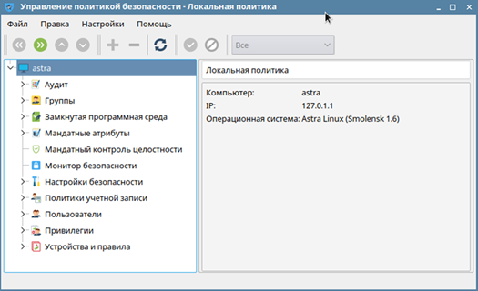

## АННОТАЦИЯ

Документ содержит информацию о безопасной установке и настройке серверных и клиентских компонентов, сведения для проверки, обеспечения функционирования и настройки на условия конкретного применения «Программной платформы «SCADA-R» (далее по тексту «Платформа SCADA-R»)

## 1.  Общие сведения о программе

### 1.1  Назначение программы

«Платформа «SCADA-R» предназначена для:

- контроля технологического процесса во всех режимах эксплуатации нормальном, аварийном, послеаварийном);
- создания видеокадров (мнемосхем);
- организации системного дерева и дерева объектов;
- организации пользователей и их ролей;
- подключения контроллеров устройств по различным протоколам;
- выставления уставок и шкал измерений;
- связывания сигналов и логических узлов объекта управления;
- экспорта журнала сообщений и трендов;
- мониторинга работоспособности компонентов «Платформы «SCADA-R».

### 1.2  Функции программы

«Платформа «SCADA-R» обеспечивает выполнение следующих функций:

- сигнализации;
- контроля работоспособности компонентов системы;
- информационных;
- управления;
- обеспечения информационной безопасности.

### 1.2.1  Функции сигнализации

Выполнение функций сигнализации обеспечивает:

- выявление предаварийных и аварийных ситуаций, путем анализа
    информации измерительных каналов.

### 1.2.2  Функции контроля работоспособности компонентов системы

Выполнение функций контроля работоспособности компонентов системы
обеспечивает:

- контроль доступности оборудования;
- контроль работоспособности составных частей системы.

### 1.2.3 Информационные функции

Выполнение информационных функций обеспечивает:

- непрерывное формирование архива по измеренным параметрам (с
    контролем достоверности);
- непрерывная индикация измеряемых значений параметров оборудования;
- регистрация и представление обслуживающему персоналу информации о
    выходе измеренных значений параметра за установленные пределы;
- представление обслуживающему персоналу информации о техническом
    состоянии объекта контроля и обнаружение его изменения;
- представление обслуживающему персоналу информации о срабатывании
    аварийно-предупредительной сигнализации;
- представление обслуживающему персоналу информации о действующих
    значениях уставок;
- представление обслуживающему персоналу информации о неисправности
    составных частей системы;
- вывод графической информации (трендов) по запросу оператора;
- вывод информации о событиях в журналах.

### 1.2.4  Функции управления

Выполнение функций управления обеспечивает ручное (диспетчерское)
формирование команд устройствам.

### 1.2.5  Функции обеспечения информационной безопасности

Выполнение функций информационной безопасности обеспечивает:

- вход пользователей по логину/паролю, в ходе которого осуществляются
    процедуры присвоения и сопоставления идентификаторов пользователей,
    проверка на требования к сложности пароля, защита обратной связи при
    его вводе;
- управление доступом к информации на основе пользовательских ролей и
    привилегий;
- ведение журнала регистрации событий безопасности (аутентификации и
    авторизации пользователей, попыток неудачного входа в систему и
    получения доступа к данным).

## 2.  Основные характеристики

### 2.1  Состав «Платформы «SCADA-R»

«Платформа «SCADA-R» поддерживает многопользовательский режим работы.
Доступность пунктов меню, возможность доступа к тем или иным окнам или
данным зависит от роли и привилегий пользователя.

Сервисы платформы имеют возможность хранения локальной информации в
собственной БД (СУБД может быть одна, архитектурные ограничения не
накладываются).

Все сервисы, предоставляющие защищаемую информацию, обеспечивают
валидацию факта авторизации пользователя и корректно отвечают в
зависимости от факта авторизации.

Например, при изменении конфигурации сервис конфигурации рассылает
нотификацию о факте изменения, сама измененная конфигурация
предоставляется по отдельному запросу.

Для обеспечения надежности серверные компоненты имеют возможность
работать в режиме дублирования.

В состав «Платформы «SCADA-R» входят следующие программные компоненты:

- серверное ПО обработки, хранения и передачи информации:

1. сервис обработки и предоставления данных;
2. сервис хранения и предоставления исторических значений;
3. сервис хранения и предоставления конфигурации автоматизируемого
    объекта;
4. системная утилита создания учетной записи Администратора ИБ;
5. сервис управления учетными записями;
6. сервис контроля доступа;
7. сервис управления драйверами;
8. сервис обработки запросов и контроля исполнения команд;

- клиентское ПО, представляющее собой графический интерфейс
    организации оперативного взаимодействия с пользователем:

1. приложение отображения данных и оперативного управления (SCADA-R
    Пульт);
2. приложение управления Администратора ИБ (SCADA-R Администрирование);

- коммуникационное ПО обмена с внешними устройствами и системами.
    Интеграционные драйвера протоколов для взаимодействия по
    стандартизованным протоколам обмена с информационно-управляющими
    системами и устройствами:

1. драйвер «Modbus-TCP»;
2. драйвер «SNMP-v2c»;
3. драйвер «iec-104».

### 2.2 Требования к аппаратному и программному обеспечению

В зависимости от функционального назначения предъявляются различные
требования к составу и параметрам технических средств различных
составных частей программного обеспечения. В таблицах 1-3 приведены
рекомендуемые параметры технических и программных средств для среды
функционирования «Платформы «SCADA-R»:

Таблица 1 - Требования к среде функционирования серверных программных
модулей

| Параметр | Значение |
| --- | --- |
| Операционная система | Astra Linux 1.6 Special Edition; Ubuntu Server 18.04 LTS |
| Процессор |  Архитектура x86-64 |
| Объем оперативной памяти | 16 ГБ |
| Сетевой интерфейс Ethernet | Ethernet 1 Гбит/с -- 2 шт              |
| Жесткий диск               | SSD 2\*2 ТБ                            |

Таблица 2 - Требования к среде функционирования клиентских программных
модулей
| Параметр | Значение |
| --- | --- |
| Операционная система | Astra Linux 1.6 Special Edition; Ubuntu Server 18.04 LTS; Windows 10 |
| Процессор |  Архитектура x86-64 |
| Объем оперативной памяти | 16 ГБ |
| Сетевой интерфейс Ethernet | Ethernet 1 Гбит/с -- 2 шт              |

Таблица 3 - Требования к среде функционирования коммуникационных
программных модулей
| Параметр | Значение |
| --- | --- |
| Операционная система | Astra Linux 1.6 Special Edition; Ubuntu Server 18.04 LTS |
| Процессор |  Архитектура x86-64 |
| Объем оперативной памяти | 4 ГБ |
| Сетевой интерфейс Ethernet | Ethernet 1 Гбит/с -- 2 шт              |

Все оборудование, на котором запускается программное обеспечение, должно
быть объединено в TCP/IP сеть.

Помимо этого, для функционирования «Платформы «SCADA-R» необходимы
следующие дополнительные программные компоненты:

- серверное ПО обработки, хранения и передачи информации:

1. Система управления базами данных (СУБД) PostgreSQL v. 9.6 (входит в
    состав поставки ОС Astra Linux 1.6);

2. Коммуникационная шина RabbitMQ v. 3.6.10 (входит в состав поставки
    ОС Astra Linux 1.6).

## 3. Установка и настройка среды функционирования

### 3.1 Установка ОС Astra Linux 1.6 Special Edition («Смоленск»)

Перед установкой и настройкой ОС Astra Linux 1.6 Special Edition
(«Смоленск») администратору необходимо ознакомится с перечнем
нижеследующей эксплуатационной документации, входящей в поставку ОС:

1. Операционная система специального назначения «Astra Linux Special
    Edition». Руководство администратора, часть 1. РУСБ 10015-01 95
    01-1;
2. Операционная система специального назначения «Astra Linux Special
    Edition». Руководство администратора, часть 2. РУСБ 10015-01 95
    01-2;
3. Операционная система специального назначения «Astra Linux Special
    Edition». Руководство по комплексу средств защиты информации,
    часть 1. РУСБ 10015-01 97 01-1;
4. Операционная система специального назначения «Astra Linux Special
    Edition». Руководство по комплексу средств защиты информации,
    часть 2. РУСБ 10015-01 97 01-2.
В самом начале загрузки программы установки на экране монитора
появляется логотип ОС, меню, переключатель «Русский» -- «English» (для
изменения языка меню). Меню программы установки содержит следующие
пункты:
1.«Графическая установка»;
2.«Установка»;
3.«Режим восстановления».
Чтобы начать установку ОС, следует выбрать пункт «Графическая установка»
или «Установка» с помощью клавиш со стрелками на клавиатуре и нажать
**\<**Enter**\>** для запуска программы. Произойдет переход к программе
установки в графическом или в текстовом режиме, соответственно.

Программа установки в графическом и в текстовом режимах имеет одинаковую
функциональность, так как в обоих случаях используются одни и те же
модули, то есть отличаются они только на уровне пользовательского
интерфейса.

Для графической установки ОС необходимо:

- загрузить программу установки ОС с носителя;
- выбрать настройки программы установки и оборудования;
- активировать подключение к сети Ethernet;
- создать учетную запись и пароль пользователя;
- настроить время;
- создать и смонтировать дисковые разделы, на которые будет
    установлена ОС;
- выбрать и установить необходимое программное обеспечение (ПО). После
    установки базовой системы предоставляется возможность (при
    необходимости) выбрать дополнительное ПО для установки:
- базовые средства;
- рабочий стол Fly;
- приложения для работы с сенсорным экраном;
- средства работы в сети;
- офисные средства;
- СУБД;
- средства удаленного доступа SSH;
- защищенный web-сервер;
- средства виртуализации;
- средства мультимедиа;
- служба ALD;
- выбрать и установить (при необходимости) дополнительные настройки
   безопасности
    ОС[;](https://www.itworkroom.com/man-astra-linux/#page20)
- установить и настроить системный загрузчик Grub;
- загрузить установленную ОС в первый раз.

### 3.2 Настройки ОС Astra Linux 1.6 Special Edition («Смоленск»)

Настройка ОС Astra Linux 1.6 Special Edition («Смоленск») производится в
соответствии с нормативными требованиями безопасности, а также самим
заказчиком АСУ ТП. В данном документе приводится описание возможностей
дополнительных функции безопасности ОС:

1\) «Включить режим замкнутой программной среды»

При выборе данного пункта будет включен механизм, обеспечивающий
проверку неизменности и подлинности загружаемых исполняемых файлов
формата ELF (см. РУСБ.10015-01 97 01-1);

2\) «Запретить установку бита исполнения»

При выборе данного пункта будет включен режим запрета установки бита
исполнения, обеспечивающий предотвращение несанкционированного создания
пользователями или непреднамеренного создания администратором
исполняемых сценариев для командной оболочки (см. РУСБ.10015-01 97
01-1);

3\) «Использовать по умолчанию ядро Hardened»

При выборе данного пункта будет обеспечено использование средств
ограничения доступа к страницам памяти (см. РУСБ.10015-01 97 01-1);

4\) «Запретить вывод меню загрузчика»

При выборе данного пункта будет запрещен вывод меню загрузчика Grub. В
процессе загрузки будет загружаться ядро ОС, выбранное по умолчанию;

5\) «Включить очистку разделов страничного обмена»

При выборе данного пункта будет включен режим очистки памяти разделов
подкачки swap (см. РУСБ.10015-01 97 01-1);

6\) «Включить очистку освобождаемых областей для EXT-разделов»

При выборе данного пункта будет включен режим очистки блоков ФС
непосредственно при их освобождении (см. РУСБ.10015-01 97 01-1);

7\) «Включить блокировку консоли»

При выборе данного пункта будет блокирован консольный вход в систему для
пользователя и запуск консоли из графического интерфейса сессии
пользователя (см. РУСБ.10015-01 97 01-1);

8\) «Включить блокировку интерпретаторов»

При выборе данного пункта будет блокировано интерактивное использование
интерпретаторов (см. РУСБ.10015-01 97 01-1);

9\) «Включить межсетевой экран ufw»

При выборе данного пункта будет включен межсетевой экран ufw и запущена
фильтрация сетевых пакетов в соответствии с заданными настройками (см.
РУСБ.10015-01 97 01-1);

10\) «Включить системные ограничения ulimits»

При выборе данного пункта будут включены системные ограничения,
установленные

файле /etc/security/limits.conf (см. РУСБ.10015-01 97 01-1);

11\) «Отключить возможность трассировки ptrace»

При выборе данного пункта будет отключена возможность трассировки и
отладки выполнения программного кода (см. РУСБ.10015-01 97 01-1);

12\) «Отключить автоматическую настройку сети»

При выборе данного пункта будет отключена автоматическая настройка сети
в процессе установки ОС;

13\) «Установить 32-х битный загрузчик»

При выборе данного пункта из системы будет удален 64-х битный загрузчик
EFI и установлен 32-х битный загрузчик EFI.

1. Описание программы «Управление политикой безопасности»
    (fly-admin-smc)

Программа предназначена для управления политикой безопасности (ПБ), а
также управления единым пространством пользователя (ЕПП). В частности,
позволяет управлять:

- пользователями, группами, настройками и атрибутами: мандатным
    разграничением доступа (МРД) пользователя, параметрами
    протоколирования, привилегиями, политикой срока действия пароля,
    политикой блокировки;

- базами данных Parsec (аудитом, мандатными атрибутами и
    привилегиями);

- политикой создания пользователей;

- настройками безопасности (устанавливать параметры монтирования для
    очистки блоков памяти при их освобождении, настраивать очистку
    разделов страничного обмена при выключении системы);

- параметрами подключения внешних устройств (учитывать носители и
    управлять их принадлежностью, протоколированием и мандатными
    атрибутам.

При работе с политиками безопасности программа выполняет те же действия,
что консольная утилита ald-admin. Запускается в режиме администратора.
Для вызова привилегированных действий запрашивается авторизация.

Главное окно программы содержит меню (Меню), панель инструментов (Панель
инструментов) и боковую панель для навигации по дереву настроек ПБ
(Панель навигации) с рабочей панелью справа.

Рисунок 1 - Главное окно программы «Управление политикой безопасности»

Настройки политики безопасности по своему функциональному и смысловому
значению объединяются в группы и структурно организуются в дереве
настроек ПБ, которое отображается на боковой панели навигации: «Аудит»,
«Группы», «Мандатные атрибуты», «Замкнутая программная среда»,
«Мандатные атрибуты», «Мандатный контроль целостности», «Монитор
безопасности», «Настройки безопасности», «Политики учетной записи»,
«Пользователи», «Привилегии» и «Устройства и правила».

Более подробную информацию о настройках политики безопасности по каждой
из групп можно найти в эксплуатационной документации, поставляемой
совместно с ОС Astra Linux 1.6 Special Edition («Смоленск»).

### 3.3 Установка СУБД PostgreSQL и коммуникационной шины RabbitMQ

Инсталляционные пакеты СУБД PostgreSQL и коммуникационной шины RabbitMQ
присутствуют в официальных репозиториях ОС Astra Linux 1.6 Special
Edition (Смоленск).

Чтобы просмотреть информацию о наличии инсталляционных пакетов в
репозитории, а также проверить их версию, необходимо воспользоваться
командой:

 > apt show postgresql -- для СУБД PostgreSQL;
 >
 > apt show rabbitmq-server - для шины RabbitMQ.

Для установки СУБД PostgreSQL необходимо воспользоваться командой:

 > sudo apt install postgresql

Для установки шины RabbitMQ аналогичная команда:

 > sudo apt install rabbitmq-server

### 3.2.1.  Настройка СУБД PostgreSQL и коммуникационной шины RabbitMQ

После установки PostgreSQL необходимо произвести следующие настройки:

- создать базу данных: «scadar»;
- имя пользователя: любое;
- пароль пользователя: любой.

Для коммуникационной шины RabbitMQ все настройки остаются по умолчанию.
Дополнительно необходимо разрешить плагин управления
`rabbitmq_management`, выполнив следующую команду:

> sudo rabbitmq-plugins enable rabbitmq_management

## 4. Установка и настройка «Платформы «SCADA-R»

### 4.1 Установка «Платформы «SCADA-R»

Состав и содержание дистрибутивного носителя данных программного
продукта «Платформа «SCADA-R» представлен в таблице 4.

Таблица 4 -- Состав и содержание дистрибутива «Платформы «SCADA-R»

| Наименование инсталляционного программного пакета (файла) |Назначение |
|     ---                          |    ---                          |
| Серверная часть (Backend)                                          |
| backend-0.0.1.0-amd64.deb        |  Инсталляционный пакет для серверной части «Платформы «SCADA-R», устанавливаемый на ОС Astra Linux 1.6 Special Edition (Смоленск) или Ubuntu v18.04 LTS и выше   |
| Клиентская часть (Frontend)      |                                  |
| hmi-engineer-0.0.1.0-amd64.deb   | Инсталляционный пакет «SCADA-R Пульт» для ОС Astra Linux 1.6 Special Edition (Смоленск) или Ubuntu v18.04 LTS и выше         |
| admin-panel-0.0.1.0-amd64.deb    | Инсталляционный пакет «SCADA-R Администрирование» для ОС Astra Linux 1.6 Special Edition (Смоленск) или Ubuntu v18.04 LTS и выше           |
| hmi-engineer-setup-0.0.1.0-amd64.exe | Инсталляционный пакет «SCADA-R   Пульт» для ОС MS Windows 10      |
| admin-panel-setup-0.0.1.0-amd64.exe | Инсталляционный пакет «SCADA-R Администрирование» для ОС MS  Windows 10    |
|Утилиты CLI                      |                                  |
| admin-setup.exe                  | Утилита для создания первичного   пользователя -- Администратора ИБ для ОС Astra Linux 1.6  Special Edition (Смоленск) или   Ubuntu v18.04 LTS и выше|
| systree-importer.exe             | Утилита для импорта в «Системное       дерево» файла структуры дерева    объектов - «root.yaml» и файлов  списков сигналов «iec-104.csv»,   «modbus-tcp.csv», «snmp-v2c.csv» для ОС Astra Linux 1.6 Special   Edition (Смоленск), Ubuntu        v18.04 LTS или ОС MS Windows 10  |
| systree-exporter.exe             | Утилита для экспорта из         «Системного дерева» в файл        структуры дерева объектов - «root.yaml» и в файлы списков     сигналов «iec-104.csv»,           «modbus-tcp.csv», «snmp-v2c.csv»    для ОС Astra Linux 1.6 Special   Edition (Смоленск), Ubuntu        v18.04 LTS или ОС MS Windows 10  |

Для работы с вышеуказанными «debian» пакетами необходимо обладать
правами «sudo».

Установка «deb» пакета проводится из терминала. Для этого необходимо
перейти в папку, в которую был скопирован «deb» пакет, а далее выполнить
команду по его распаковке и установке, например:

> sudo dpkg -i hmi-engineer-\<version\>-amd64.deb

Аналогичным образом устанавливаются все инсталляционные «deb» пакеты,
поставляемые в дистрибутиве программного продукта «Платформа «SCADA-R»
для ОС Astra Linux или Ubuntu.

Примечание -- если установка клиентской части завершилась с ошибкой
«dpkg: зависимости пакетов не позволяют настроить пакет», установите
указанные в сообщении пакеты.

Консольные утилиты «systree-importer», «systree-exporter», а также
«admin-setup» не требуют инсталляции, их достаточно скопировать с
дистрибутивного диска и убедиться, что скопированные файлы являются
исполняемыми. Для того, чтобы сделать файл исполняемым необходимо
выполнить следующую команду:

> \$ chmod +x \<путь_к\_файлу\>

В целях безопасности, рекомендуется удалить с ПК утилиту «admin-setup»
после создания первичного пользователя -- Администратора ИБ.

Версия устанавливаемого программного продукта указана в названии самих
инсталляционных файлов и пакетов, а также в файле описания дистрибутива

- «README.md», расположенного в корне дистрибутива.

Более подробная информация об установке «Платформы «SCADA-R»
представлена в документе 46865053.00012-01 32 «Руководство системного
программиста».

## 5.  Проверка программы на соответствие требованиям функциональной и информационной безопасности

### 5.1  Состав требований функциональной и информационной безопасности по приемке «Платформы «SCADA-R»

Состав требований функциональной и информационной безопасности для
«Платформы «SCADA-R» конкретной АСУ ТП, а также виды проверок этих
требований определяются нижеследующими нормативными документами, а также
самим заказчиком разработки АСУ ТП.

1. [ГОСТ Р 56939-2016 Защита информации. Разработка безопасного
    программного обеспечения. Общие
    требования](http://docs.cntd.ru/document/1200135525);

2. [ГОСТ Р ИСО/МЭК 15408-1-2012 Информационная технология (ИТ). Методы
    и средства обеспечения безопасности. Критерии оценки безопасности
    информационных технологий. Часть 1. Введение и общая
    модель](http://docs.cntd.ru/document/1200105710);

3. [ГОСТ Р ИСО/МЭК 15408-2-2013 Информационная технология (ИТ). Методы
    и средства обеспечения безопасности. Критерии оценки безопасности
    информационных технологий. Часть 2. Функциональные компоненты
    безопасности](http://docs.cntd.ru/document/1200105710);

4. [ГОСТ Р ИСО/МЭК 15408-3-2013 Информационная технология (ИТ). Методы
    и средства обеспечения безопасности. Критерии оценки безопасности
    информационных технологий. Часть 3. Компоненты доверия к
    безопасности](http://docs.cntd.ru/document/1200135525);

5. [Выписка из Требований по безопасности информации, утвержденных
    приказом ФСТЭК России от 2 июня 2020 г. N
    76](https://fstec.ru/tekhnicheskaya-zashchita-informatsii/dokumenty-po-sertifikatsii/120-normativnye-dokumenty/2126-vypiska-iz-trebovanij-po-bezopasnosti-informatsii-utverzhdennykh-prikazom-fstek-rossii-ot-2-iyunya-2020-g-n-76).

Основным документом для оценки соответствия «Платформы «SCADA-R»
требованиям ИБ является Задание по безопасности разрабатываемое в
соответствии с ГОСТ Р ИСО/МЭК 15408-3.

Все испытания и проверки (включая дополнительные) по требованиям ИБ
проводят в объеме требований доверия, включенных в Задание по
безопасности.
